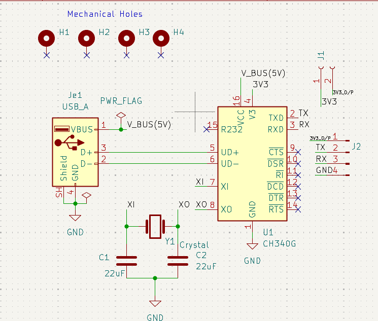
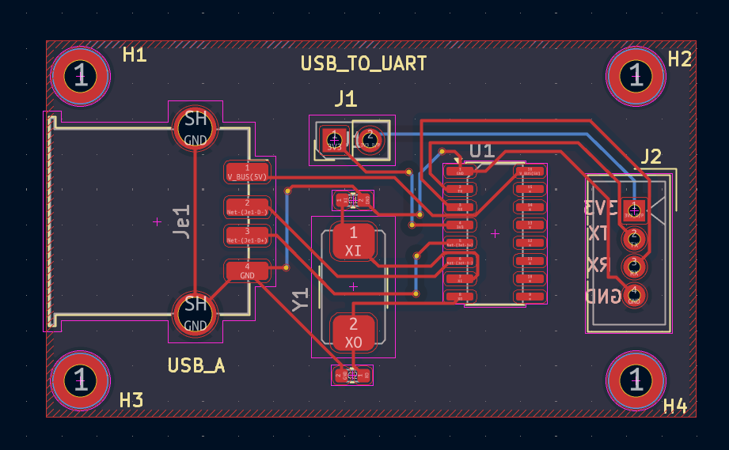

# USB-UART Converter PCB

## 📌 Overview

This project is a USB-to-UART Converter PCB designed using KiCad. It is used to interface a computer with UART-based embedded systems.

## ✨ Features

- USB to UART Communication
- 2-Layer PCB Design
- Compact PCB Layout
- ERC and DRC Checked
- Manufacturing Ready Gerber Files
- ## 🛠 Software Used

- KiCad 10

## 📂 Project Files

- KiCad Project (.kicad_pro)
- Schematic (.kicad_sch)
- PCB Layout (.kicad_pcb)
- Gerber Files
- Project images
## 📷 Project Images

### Schematic

### PCB Layout

### Top 3D View

### Bottom 3D View

